# Fullstack Template

A production-ready, AI-optimized fullstack development template featuring ASP.NET Core 9 and React 19.

## 🚀 Features

- **Test-Driven Development**: Built-in TDD workflow with comprehensive testing
- **AI-Powered Development**: Optimized for Claude Code with custom commands
- **Modern Tech Stack**: Latest ASP.NET Core 9, React 19, TypeScript
- **Clean Architecture**: Separation of concerns, SOLID principles
- **Type Safety**: Full TypeScript and C# coverage
- **Developer Experience**: Hot reload, fast tests, instant feedback

## 📋 Prerequisites

- [.NET 9 SDK](https://dotnet.microsoft.com/download/dotnet/9.0)
- [Bun](https://bun.sh/) (or Node.js 20+)
- [SQLite](https://www.sqlite.org/) (or PostgreSQL)
- [Git](https://git-scm.com/)
- Claude Code or VS Code

## 🎯 Quick Start

### 1. Clone and Setup

```bash
# Clone the template
git clone https://github.com/yourusername/fullstack-template.git my-project
cd my-project

# Run setup script
chmod +x scripts/setup.sh
./scripts/setup.sh
```

### 2. Start Development

```bash
# Terminal 1: Backend
cd backend/src/Api
dotnet watch run

# Terminal 2: Frontend
cd frontend
bun run dev
```

### 3. Run Tests

```bash
# All tests
./scripts/test-all.sh

# Backend only
cd backend && dotnet test

# Frontend only
cd frontend && bun test
```

Visit:
- Frontend: http://localhost:5173
- Backend API: http://localhost:5000
- Swagger: http://localhost:5000/swagger

## 🏗️ Project Structure

```
fullstack-template/
├── .claude/               # Claude Code configuration
│   ├── settings.json      # AI permissions and hooks
│   ├── commands/          # Custom AI commands (/tdd, /review, /plan)
│   └── agents/            # Specialized AI agents
├── backend/               # ASP.NET Core 9
│   ├── src/Api/          # Main API project
│   └── tests/            # Unit & integration tests
├── frontend/              # React 19 + TypeScript
│   ├── src/              # Application code
│   └── __tests__/        # Unit, integration, E2E tests
├── docs/                  # Documentation
│   ├── adr/              # Architecture Decision Records
│   ├── specs/            # Feature specifications
│   └── diagrams/         # Architecture diagrams
└── scripts/               # Automation scripts
```

## 🧪 Testing Philosophy

This template uses **Test-Driven Development (TDD)**:

```
Red (Write failing test) 
  → Green (Make it pass) 
    → Refactor (Improve code) 
      → Commit
```

### Run Tests

```bash
# Backend
cd backend
dotnet test --verbosity normal

# Frontend
cd frontend
bun test --coverage

# E2E
cd frontend
bun run test:e2e
```

**Coverage Target**: 80% minimum

## 🤖 AI-Powered Development

This template is optimized for [Claude Code](https://claude.ai/code).

### Custom Commands

```bash
/tdd [feature]   # Test-Driven Development workflow
/review          # Comprehensive code review
/plan [feature]  # Create implementation plan
/spec [feature]  # Generate technical specification
```

### Specialized Agents

```bash
@test-runner     # Execute and analyze tests
@reviewer        # Code quality review
@architect       # Architecture decisions
```

### Example Workflow

```bash
# 1. Create specification
/spec User authentication with JWT

# 2. Generate implementation plan
/plan Read @docs/specs/authentication-spec.md

# 3. Execute with TDD
/tdd Implement JWT authentication

# 4. Review code quality
/review

# 5. Run all tests
@test-runner execute all tests
```

See [CLAUDE.md](./CLAUDE.md) for complete AI development guide.

## 🛠️ Tech Stack

### Backend
- **Framework**: ASP.NET Core 9 with Minimal APIs
- **ORM**: Entity Framework Core 9
- **Database**: SQLite (dev), PostgreSQL (production)
- **Validation**: FluentValidation
- **Testing**: xUnit, FluentAssertions, Moq

### Frontend
- **Framework**: React 19
- **Language**: TypeScript 5
- **Build Tool**: Vite
- **Styling**: Tailwind CSS + shadcn/ui
- **State Management**: TanStack Query (React Query)
- **Testing**: Vitest, Testing Library, Playwright

## 📖 Documentation

- [Getting Started Guide](./docs/getting-started.md)
- [Workflow Guide](./docs/workflow-guide.md)
- [Architecture Overview](./docs/diagrams/architecture.md)
- [TDD Flow](./docs/diagrams/tdd-flow.md)
- [CLAUDE.md](./CLAUDE.md) - AI development guide

## 🏛️ Architecture

### Backend: Clean Architecture

```
HTTP Request
    ↓
Endpoints (Minimal APIs)
    ↓
Validators (FluentValidation)
    ↓
Services (Business Logic)
    ↓
Repositories (Data Access)
    ↓
Database
```

### Frontend: Component-Service Pattern

```
User Interaction
    ↓
Components (Presentation)
    ↓
Hooks (TanStack Query)
    ↓
API Layer (axios)
    ↓
Backend
```

See [Architecture Diagrams](./docs/diagrams/architecture.md) for details.

## 🔧 Configuration

### Environment Variables

#### Backend (`backend/src/Api/appsettings.json`)
```json
{
  "ConnectionStrings": {
    "DefaultConnection": "Data Source=app.db"
  },
  "Jwt": {
    "Secret": "your-secret-key-min-32-characters",
    "Issuer": "your-app",
    "Audience": "your-app-users",
    "ExpirationMinutes": 60
  }
}
```

#### Frontend (`frontend/.env`)
```bash
VITE_API_URL=http://localhost:5000
```

### Database Migrations

```bash
cd backend/src/Api

# Create migration
dotnet ef migrations add MigrationName

# Apply migration
dotnet ef database update

# Rollback migration
dotnet ef database update PreviousMigration
```

## 🚢 Deployment

### Backend (ASP.NET Core)

```bash
cd backend
dotnet publish -c Release -o ./publish

# Deploy to your hosting service
# Examples: Azure App Service, AWS Elastic Beanstalk, Docker
```

### Frontend (React)

```bash
cd frontend
bun run build

# Deploy dist/ folder
# Examples: Vercel, Netlify, AWS S3 + CloudFront
```

## 📊 Code Quality

### Linting

```bash
# Backend
cd backend && dotnet format

# Frontend
cd frontend && bun run lint
cd frontend && bun run lint:fix
```

### Type Checking

```bash
# Frontend
cd frontend && bun run type-check
```

### Coverage

```bash
# Backend
cd backend && dotnet test /p:CollectCoverage=true

# Frontend
cd frontend && bun test --coverage
```

## 🤝 Contributing

1. Fork the repository
2. Create feature branch (`git checkout -b feature/amazing-feature`)
3. Write tests first (TDD)
4. Implement feature
5. Run `/review` to check quality
6. Commit changes (`git commit -m 'feat: add amazing feature'`)
7. Push to branch (`git push origin feature/amazing-feature`)
8. Open Pull Request

## 📜 License

MIT License - see [LICENSE](./LICENSE) file

## 🙏 Acknowledgments

- [ASP.NET Core](https://dotnet.microsoft.com/apps/aspnet)
- [React](https://react.dev/)
- [Vite](https://vitejs.dev/)
- [Tailwind CSS](https://tailwindcss.com/)
- [shadcn/ui](https://ui.shadcn.com/)
- [TanStack Query](https://tanstack.com/query)

---

**Built with ❤️ for rapid, test-driven development**

For AI development guide, see [CLAUDE.md](./CLAUDE.md)

## Documentation Files

### `docs/getting-started.md`

```markdown
# Getting Started Guide

Complete guide to setting up and using the Fullstack Template.

## Prerequisites

### Required Software

1. **.NET 9 SDK**
   ```bash
   # Check version
   dotnet --version
   # Should be 9.0.x or higher
   ```
   Download: https://dotnet.microsoft.com/download/dotnet/9.0

2. **Bun** (or Node.js 20+)
   ```bash
   # Install Bun
   curl -fsSL https://bun.sh/install | bash
   
   # Check version
   bun --version
   ```

3. **SQLite**
   ```bash
   # macOS
   brew install sqlite
   
   # Ubuntu/Debian
   sudo apt-get install sqlite3
   
   # Windows
   # Download from https://www.sqlite.org/download.html
   ```

4. **Git**
   ```bash
   git --version
   ```

### Optional Tools

- **Claude Code**: AI-powered development (recommended)
- **VS Code**: Alternative editor
- **Postman/Insomnia**: API testing
- **DB Browser for SQLite**: Database viewing

---

## Installation

### Step 1: Clone Template

```bash
# Using template
git clone https://github.com/yourusername/fullstack-template.git my-project
cd my-project

# Remove template git history
rm -rf .git
git init
git add .
git commit -m "Initial commit from template"
```

### Step 2: Run Setup Script

```bash
chmod +x scripts/setup.sh
./scripts/setup.sh
```

This script will:
- ✅ Install backend dependencies
- ✅ Install frontend dependencies
- ✅ Create initial database
- ✅ Run database migrations
- ✅ Create environment files
- ✅ Run initial tests

### Step 3: Verify Installation

```bash
# Backend tests
cd backend && dotnet test

# Frontend tests
cd frontend && bun test

# If all tests pass, you're ready! ✅
```

---

## Project Configuration

### Backend Configuration

**File**: `backend/src/Api/appsettings.json`

```json
{
  "Logging": {
    "LogLevel": {
      "Default": "Information",
      "Microsoft.AspNetCore": "Warning"
    }
  },
  "AllowedHosts": "*",
  "ConnectionStrings": {
    "DefaultConnection": "Data Source=app.db"
  },
  "Cors": {
    "AllowedOrigins": ["http://localhost:5173"]
  }
}
```

**Development Overrides**: `backend/src/Api/appsettings.Development.json`

```json
{
  "Logging": {
    "LogLevel": {
      "Default": "Debug",
      "Microsoft.AspNetCore": "Information"
    }
  },
  "ConnectionStrings": {
    "DefaultConnection": "Data Source=app-dev.db"
  }
}
```

### Frontend Configuration

**File**: `frontend/.env`

```bash
VITE_API_URL=http://localhost:5000
VITE_APP_NAME=My Fullstack App
```

**Production**: `frontend/.env.production`

```bash
VITE_API_URL=https://api.myapp.com
VITE_APP_NAME=My Fullstack App
```

---

## Development Workflow

### Starting Development Servers

**Option 1: Separate Terminals** (Recommended)

```bash
# Terminal 1: Backend
cd backend/src/Api
dotnet watch run

# Terminal 2: Frontend
cd frontend
bun run dev
```

**Option 2: Concurrently** (Advanced)

```bash
# Install concurrently globally
npm install -g concurrently

# From project root
concurrently "cd backend/src/Api && dotnet watch run" "cd frontend && bun run dev"
```

### Accessing Application

- **Frontend**: http://localhost:5173
- **Backend API**: http://localhost:5000
- **Swagger UI**: http://localhost:5000/swagger

### Development Commands

#### Backend

```bash
cd backend

# Run tests
dotnet test

# Run with hot reload
cd src/Api && dotnet watch run

# Format code
dotnet format

# Create migration
cd src/Api && dotnet ef migrations add MigrationName

# Apply migrations
cd src/Api && dotnet ef database update

# Build release
dotnet build -c Release
```

#### Frontend

```bash
cd frontend

# Run dev server
bun run dev

# Run tests
bun test

# Run tests in watch mode
bun test --watch

# Run E2E tests
bun run test:e2e

# Lint
bun run lint

# Fix linting issues
bun run lint:fix

# Type check
bun run type-check

# Build for production
bun run build

# Preview production build
bun run preview
```

---

## First Feature: Hello World API

Let's create your first feature using TDD!

### Step 1: Create Backend Endpoint

**File**: `backend/tests/IntegrationTests/HealthEndpointTests.cs`

```csharp
using System.Net;
using System.Net.Http.Json;
using Microsoft.AspNetCore.Mvc.Testing;
using Xunit;
using FluentAssertions;

namespace IntegrationTests;

public class HealthEndpointTests : IClassFixture<WebApplicationFactory<Program>>
{
    private readonly HttpClient _client;

    public HealthEndpointTests(WebApplicationFactory<Program> factory)
    {
        _client = factory.CreateClient();
    }

    [Fact]
    public async Task Should_ReturnOk_When_HealthEndpointCalled()
    {
        // Act
        var response = await _client.GetAsync("/api/health");

        // Assert
        response.StatusCode.Should().Be(HttpStatusCode.OK);
        
        var content = await response.Content.ReadFromJsonAsync<HealthResponse>();
        content.Should().NotBeNull();
        content!.Status.Should().Be("Healthy");
    }
}

public record HealthResponse(string Status, DateTime Timestamp);
```

**Run test** (it should fail):
```bash
cd backend && dotnet test
```

**File**: `backend/src/Api/Program.cs`

```csharp
var builder = WebApplication.CreateBuilder(args);

builder.Services.AddEndpointsApiExplorer();
builder.Services.AddSwaggerGen();

var app = builder.Build();

if (app.Environment.IsDevelopment())
{
    app.UseSwagger();
    app.UseSwaggerUI();
}

// Health endpoint
app.MapGet("/api/health", () => new HealthResponse("Healthy", DateTime.UtcNow));

app.Run();

public record HealthResponse(string Status, DateTime Timestamp);

// Make Program accessible to tests
public partial class Program { }
```

**Run test again** (should pass):
```bash
cd backend && dotnet test
```

✅ **Success!** You've completed your first TDD cycle.

---

### Step 2: Create Frontend Component

**File**: `frontend/__tests__/unit/Health.test.tsx`

```typescript
import { render, screen, waitFor } from '@testing-library/react';
import { QueryClient, QueryClientProvider } from '@tanstack/react-query';
import { describe, it, expect, vi } from 'vitest';
import Health from '@/components/Health';
import * as api from '@/lib/api/health';

describe('Health Component', () => {
  it('should display health status when loaded', async () => {
    // Arrange
    vi.spyOn(api, 'getHealth').mockResolvedValue({
      status: 'Healthy',
      timestamp: new Date().toISOString(),
    });

    const queryClient = new QueryClient({
      defaultOptions: { queries: { retry: false } },
    });

    // Act
    render(
      <QueryClientProvider client={queryClient}>
        <Health />
      </QueryClientProvider>
    );

    // Assert
    await waitFor(() => {
      expect(screen.getByText(/healthy/i)).toBeInTheDocument();
    });
  });
});
```

**File**: `frontend/src/lib/api/health.ts`

```typescript
import axios from 'axios';

const API_URL = import.meta.env.VITE_API_URL || 'http://localhost:5000';

const client = axios.create({
  baseURL: API_URL,
});

export interface HealthResponse {
  status: string;
  timestamp: string;
}

export async function getHealth(): Promise<HealthResponse> {
  const response = await client.get<HealthResponse>('/api/health');
  return response.data;
}
```

**File**: `frontend/src/components/Health.tsx`

```typescript
import { useQuery } from '@tanstack/react-query';
import { getHealth } from '@/lib/api/health';

export default function Health() {
  const { data, isLoading, error } = useQuery({
    queryKey: ['health'],
    queryFn: getHealth,
  });

  if (isLoading) return <div>Loading...</div>;
  if (error) return <div>Error loading health status</div>;

  return (
    <div className="p-4 border rounded-lg">
      <h2 className="text-xl font-bold">System Health</h2>
      <p className="mt-2">
        Status: <span className="text-green-600">{data?.status}</span>
      </p>
      <p className="text-sm text-gray-500">
        Last checked: {new Date(data?.timestamp || '').toLocaleString()}
      </p>
    </div>
  );
}
```

**Run tests**:
```bash
cd frontend && bun test
```

✅ **Success!** Your first fullstack feature is complete.

---

## Using AI Development Tools

### Claude Code Commands

#### 1. TDD Workflow

```bash
/tdd Add user registration feature

# Claude will:
# - Ask clarifying questions
# - Write tests first
# - Implement minimal code
# - Run tests continuously
# - Refactor when green
```

#### 2. Code Review

```bash
/review backend/src/Api/Services/UserService.cs

# Claude will analyze:
# - Code quality
# - Security issues
# - Performance problems
# - Architecture compliance
```

#### 3. Implementation Planning

```bash
/plan Add authentication with JWT tokens

# Claude will:
# - Read relevant files
# - Create detailed step-by-step plan
# - Estimate complexity
# - Save plan to docs/specs/
# - Wait for your approval
```

#### 4. Specification Generation

```bash
/spec User profile management with avatar upload

# Claude will:
# - Generate prompt for reasoning model
# - You paste in ChatGPT o1 or similar
# - Save detailed spec to docs/specs/
```

### Specialized Agents

```bash
# Run all tests with detailed analysis
@test-runner execute all tests

# Get comprehensive code review
@reviewer analyze recent changes

# Architecture consultation
@architect review current design and suggest improvements
```

---

## Database Management

### Creating Migrations

```bash
cd backend/src/Api

# Create migration
dotnet ef migrations add AddUserTable

# Preview SQL
dotnet ef migrations script

# Apply migration
dotnet ef database update

# Rollback to specific migration
dotnet ef database update PreviousMigrationName

# Remove last migration (if not applied)
dotnet ef migrations remove
```

### Viewing Database

**Option 1: DB Browser for SQLite**
- Download: https://sqlitebrowser.org/
- Open: `backend/src/Api/app.db`

**Option 2: Command Line**
```bash
sqlite3 backend/src/Api/app.db

# SQLite commands
.tables          # List tables
.schema users    # Show table schema
SELECT * FROM users;  # Query data
.quit            # Exit
```

---

## Testing Best Practices

### Backend Testing

**Unit Tests** - Fast, isolated
```csharp
[Fact]
public void Should_ValidateEmail_When_EmailInvalid()
{
    // Arrange
    var validator = new CreateUserDtoValidator();
    var dto = new CreateUserDto { Email = "invalid" };
    
    // Act
    var result = validator.Validate(dto);
    
    // Assert
    result.IsValid.Should().BeFalse();
    result.Errors.Should().Contain(e => e.PropertyName == "Email");
}
```

**Integration Tests** - Real database
```csharp
[Fact]
public async Task Should_CreateUser_When_ValidData()
{
    // Arrange
    var factory = new WebApplicationFactory<Program>();
    var client = factory.CreateClient();
    var dto = new CreateUserDto { Email = "test@example.com", Name = "Test" };
    
    // Act
    var response = await client.PostAsJsonAsync("/api/users", dto);
    
    // Assert
    response.StatusCode.Should().Be(HttpStatusCode.Created);
}
```

### Frontend Testing

**Component Tests** - User behavior
```typescript
test('should show error when email is invalid', async () => {
  render(<UserForm />);
  
  await userEvent.type(screen.getByLabelText(/email/i), 'invalid');
  await userEvent.click(screen.getByRole('button', { name: /submit/i }));
  
  expect(await screen.findByText(/valid email/i)).toBeInTheDocument();
});
```

**E2E Tests** - Complete flows
```typescript
test('user can complete registration', async ({ page }) => {
  await page.goto('http://localhost:5173/register');
  
  await page.fill('[name="email"]', 'test@example.com');
  await page.fill('[name="password"]', 'SecurePass123!');
  await page.click('button[type="submit"]');
  
  await expect(page).toHaveURL('/dashboard');
});
```

---

## Common Issues & Solutions

### Issue: Port Already in Use

**Backend (5000)**
```bash
# Find process using port
lsof -i :5000

# Kill process
kill -9 <PID>
```

**Frontend (5173)**
```bash
# Kill process
lsof -i :5173 | grep LISTEN | awk '{print $2}' | xargs kill -9
```

### Issue: Database Locked

```bash
# Stop all applications using database
# Delete database file
rm backend/src/Api/app.db*

# Recreate
cd backend/src/Api
dotnet ef database update
```

### Issue: Tests Failing After Fresh Clone

```bash
# Clean and rebuild
cd backend
dotnet clean
dotnet build

cd ../frontend
rm -rf node_modules
bun install

# Run setup script again
./scripts/setup.sh
```

### Issue: CORS Errors

**Backend**: `backend/src/Api/Program.cs`
```csharp
builder.Services.AddCors(options =>
{
    options.AddDefaultPolicy(policy =>
    {
        policy.WithOrigins("http://localhost:5173")
              .AllowAnyHeader()
              .AllowAnyMethod();
    });
});

var app = builder.Build();
app.UseCors();
```

---

## Next Steps

1. **Read the Workflow Guide**: [docs/workflow-guide.md](./workflow-guide.md)
2. **Review Architecture**: [docs/diagrams/architecture.md](./diagrams/architecture.md)
3. **Explore CLAUDE.md**: AI development patterns
4. **Build Your First Feature**: Use `/plan` and `/tdd`

---

## Getting Help

- **Documentation**: Check `docs/` folder
- **Architecture Decisions**: Review `docs/adr/`
- **AI Help**: Use `/review` or ask @architect
- **Community**: [GitHub Issues](https://github.com/yourusername/fullstack-template/issues)

---

**Happy coding! 🚀**
```

---

### `docs/workflow-guide.md`

```markdown
# Workflow Guide

Complete guide to development workflows in the Fullstack Template.

## Table of Contents

1. [Feature Development Workflow](#feature-development-workflow)
2. [Test-Driven Development](#test-driven-development)
3. [Git Workflow](#git-workflow)
4. [Code Review Process](#code-review-process)
5. [Deployment Workflow](#deployment-workflow)

---

## Feature Development Workflow

### Phase 1: Planning (Explore)

Before writing ANY code, understand the feature completely.

#### Step 1: Clarify Requirements

```bash
# Use AI to help clarify
/plan [feature description]

# AI will ask clarifying questions:
# - What is the exact behavior?
# - What are the edge cases?
# - What are the performance requirements?
# - What are the security considerations?
```

**Questions to Answer**:
- Who is the user?
- What problem does this solve?
- What is the success criteria?
- What are the constraints?

#### Step 2: Create Specification (Optional for Complex Features)

```bash
# Generate detailed spec
/spec [feature description]

# Copy prompt to reasoning model (ChatGPT o1)
# Save output to docs/specs/[feature-name]-spec.md
```

#### Step 3: Design Architecture

```bash
# Consult architect agent
@architect design [feature] considering current architecture

# Architect will:
# - Analyze current state
# - Propose architecture
# - Create diagrams
# - Identify integration points
```

#### Step 4: Create Implementation Plan

```bash
# Generate step-by-step plan
/plan Read @docs/specs/[feature]-spec.md and create implementation plan

# Plan will include:
# - Detailed steps (each <2 hours)
# - Testing strategy per step
# - Dependencies between steps
# - Risk assessment
```

**Approval Checkpoint**: Review plan with team before proceeding.

---

### Phase 2: Implementation (Execute)

Execute the approved plan using TDD.

#### Step 1: Setup Feature Branch

```bash
git checkout -b feature/user-authentication
```

#### Step 2: TDD Cycle for Each Component

```bash
/tdd Implement JWT token generation

# For each component:
# 1. Write failing test
# 2. Run test (verify it fails)
# 3. Write minimal implementation
# 4. Run test (verify it passes)
# 5. Refactor
# 6. Commit
```

**Example: Backend Service**

1. **Write Test** (`backend/tests/UnitTests/Services/AuthServiceTests.cs`)

```csharp
[Fact]
public async Task Should_GenerateToken_When_CredentialsValid()
{
    // Arrange
    var mockUserRepo = new Mock<IUserRepository>();
    mockUserRepo.Setup(r => r.GetByEmailAsync("test@example.com"))
                .ReturnsAsync(new User 
                { 
                    Id = 1, 
                    Email = "test@example.com",
                    PasswordHash = BCrypt.Net.BCrypt.HashPassword("password123")
                });
    
    var authService = new AuthService(mockUserRepo.Object, _jwtSettings);
    
    // Act
    var result = await authService.LoginAsync(new LoginDto 
    { 
        Email = "test@example.com", 
        Password = "password123" 
    });
    
    // Assert
    result.Should().NotBeNull();
    result.Token.Should().NotBeNullOrEmpty();
    result.ExpiresAt.Should().BeAfter(DateTime.UtcNow);
}
```

2. **Run Test** (should fail)
```bash
cd backend && dotnet test
```

3. **Implement**

```csharp
public class AuthService : IAuthService
{
    private readonly IUserRepository _userRepository;
    private readonly JwtSettings _jwtSettings;
    
    public async Task<AuthResponse> LoginAsync(LoginDto dto)
    {
        var user = await _userRepository.GetByEmailAsync(dto.Email);
        if (user == null || !BCrypt.Net.BCrypt.Verify(dto.Password, user.PasswordHash))
            throw new UnauthorizedException("Invalid credentials");
        
        var token = GenerateJwtToken(user);
        var expiresAt = DateTime.UtcNow.AddMinutes(_jwtSettings.ExpirationMinutes);
        
        return new AuthResponse(token, expiresAt);
    }
    
    private string GenerateJwtToken(User user)
    {
        // JWT generation logic
    }
}
```

4. **Run Test** (should pass)
```bash
cd backend && dotnet test
```

5. **Refactor** (if needed)

6. **Commit**
```bash
git add .
git commit -m "feat(auth): add JWT token generation"
```

#### Step 3: Integration Testing

After individual components work, test integration.

```csharp
[Fact]
public async Task Should_ReturnToken_When_PostToLoginEndpoint()
{
    // Arrange
    var client = _factory.CreateClient();
    var loginDto = new LoginDto 
    { 
        Email = "test@example.com", 
        Password = "password123" 
    };
    
    // Act
    var response = await client.PostAsJsonAsync("/api/auth/login", loginDto);
    
    // Assert
    response.StatusCode.Should().Be(HttpStatusCode.OK);
    var auth = await response.Content.ReadFromJsonAsync<AuthResponse>();
    auth.Should().NotBeNull();
    auth!.Token.Should().NotBeNullOrEmpty();
}
```

#### Step 4: Frontend Implementation

**Write Test First**:

```typescript
test('should login successfully with valid credentials', async () => {
  // Mock API
  vi.spyOn(api, 'login').mockResolvedValue({
    token: 'fake-jwt-token',
    expiresAt: new Date(Date.now() + 3600000).toISOString(),
  });
  
  render(<LoginForm />);
  
  await userEvent.type(screen.getByLabelText(/email/i), 'test@example.com');
  await userEvent.type(screen.getByLabelText(/password/i), 'password123');
  await userEvent.click(screen.getByRole('button', { name: /login/i }));
  
  await waitFor(() => {
    expect(screen.getByText(/login successful/i)).toBeInTheDocument();
  });
});
```

**Implement Component**:

```typescript
export function LoginForm() {
  const [email, setEmail] = useState('');
  const [password, setPassword] = useState('');
  const loginMutation = useLogin();
  
  const handleSubmit = async (e: React.FormEvent) => {
    e.preventDefault();
    await loginMutation.mutateAsync({ email, password });
  };
  
  return (
    <form onSubmit={handleSubmit}>
      <input 
        aria-label="Email"
        type="email"
        value={email}
        onChange={(e) => setEmail(e.target.value)}
      />
      <input 
        aria-label="Password"
        type="password"
        value={password}
        onChange={(e) => setPassword(e.target.value)}
      />
      <button type="submit">Login</button>
      {loginMutation.isSuccess && <p>Login successful!</p>}
    </form>
  );
}
```

#### Step 5: E2E Testing

```typescript
test('complete login flow', async ({ page }) => {
  await page.goto('http://localhost:5173/login');
  
  await page.fill('[name="email"]', 'test@example.com');
  await page.fill('[name="password"]', 'password123');
  await page.click('button[type="submit"]');
  
  await expect(page).toHaveURL('/dashboard');
  await expect(page.locator('text=Welcome')).toBeVisible();
});
```

---

### Phase 3: Review & Quality

#### Step 1: Self Review

```bash
# Run comprehensive review
/review

# Check for:
# - Security issues
# - Performance problems
# - Code quality
# - Architecture compliance
```

#### Step 2: Run All Tests

```bash
# Run full test suite
./scripts/test-all.sh

# Or individually:
cd backend && dotnet test --verbosity normal
cd frontend && bun test --coverage
cd frontend && bun run test:e2e
```

**Required**:
- ✅ All tests passing
- ✅ Coverage >80%
- ✅ No linter errors

#### Step 3: Code Quality Checks

```bash
# Backend formatting
cd backend && dotnet format

# Frontend linting
cd frontend && bun run lint:fix

# Type checking
cd frontend && bun run type-check
```

#### Step 4: Update Documentation

- [ ] Update README if public API changed
- [ ] Create ADR if architectural decision made
- [ ] Update diagrams if architecture changed
- [ ] Add comments for complex logic

---

### Phase 4: Deployment

#### Step 1: Final Testing

```bash
# Run on clean state
git stash
./scripts/setup.sh
./scripts/test-all.sh
git stash pop
```

#### Step 2: Create Pull Request

```bash
git push origin feature/user-authentication

# Create PR with:
# - Clear description
# - Link to specification
# - Test coverage report
# - Screenshots (if UI changes)
```

#### Step 3: Team Review

PR should be reviewed by:
- [ ] Another developer (code review)
- [ ] QA (if available)
- [ ] Product Owner (feature validation)

#### Step 4: Merge & Deploy

```bash
# After approval
git checkout main
git pull origin main
git merge feature/user-authentication
git push origin main

# CI/CD will handle deployment
```

---

## Test-Driven Development

### TDD Mindset

**TDD is NOT about testing. It's about DESIGN.**

Tests are **specifications** written in code.

### TDD Cycle

```
┌─────────────────┐
│  1. Write Test  │
│     (RED)       │
└────────┬────────┘
         │
         ▼
┌─────────────────┐
│   2. Run Test   │
│  (Verify Fail)  │
└────────┬────────┘
         │
         ▼
┌─────────────────┐
│  3. Implement   │
│    (Minimal)    │
└────────┬────────┘
         │
         ▼
┌─────────────────┐
│   4. Run Test   │
│  (Verify Pass)  │ ──┐
└────────┬────────┘   │ If Fail
         │            │
         ▼            ▼
┌─────────────────┐   │
│  5. Refactor    │   │
│  (Improve Code) │ <─┘
└────────┬────────┘
         │
         ▼
┌─────────────────┐
│   6. Commit     │
└────────┬────────┘
         │
         └───────> Repeat for next behavior
```

### TDD Examples

#### Backend Example: Email Validation

**Step 1: Write Test**
```csharp
[Theory]
[InlineData("test@example.com", true)]
[InlineData("invalid-email", false)]
[InlineData("", false)]
[InlineData(null, false)]
public void Should_ValidateEmail_Correctly(string email, bool expectedValid)
{
    // Arrange
    var validator = new CreateUserDtoValidator();
    var dto = new CreateUserDto { Email = email, Name = "Test" };
    
    // Act
    var result = validator.Validate(dto);
    
    // Assert
    if (expectedValid)
        result.IsValid.Should().BeTrue();
    else
        result.Errors.Should().Contain(e => e.PropertyName == "Email");
}
```

**Step 2: Run Test** (Fails - validator doesn't exist)

**Step 3: Implement**
```csharp
public class CreateUserDtoValidator : AbstractValidator<CreateUserDto>
{
    public CreateUserDtoValidator()
    {
        RuleFor(x => x.Email)
            .NotEmpty()
            .EmailAddress();
    }
}
```

**Step 4: Run Test** (Passes ✅)

**Step 5: Refactor** (Already clean)

**Step 6: Commit**
```bash
git add .
git commit -m "feat(validation): add email validation for CreateUserDto"
```

#### Frontend Example: Form Validation

**Step 1: Write Test**
```typescript
test('should display error when email is invalid', async () => {
  render(<RegistrationForm />);
  
  const emailInput = screen.getByLabelText(/email/i);
  const submitButton = screen.getByRole('button', { name: /register/i });
  
  await userEvent.type(emailInput, 'invalid-email');
  await userEvent.click(submitButton);
  
  expect(await screen.findByText(/valid email address/i)).toBeInTheDocument();
});
```

**Step 2: Run Test** (Fails)

**Step 3: Implement**
```typescript
export function RegistrationForm() {
  const [email, setEmail] = useState('');
  const [emailError, setEmailError] = useState('');
  
  const validateEmail = (value: string) => {
    if (!value.includes('@')) {
      setEmailError('Please enter a valid email address');
      return false;
    }
    setEmailError('');
    return true;
  };
  
  const handleSubmit = (e: React.FormEvent) => {
    e.preventDefault();
    if (!validateEmail(email)) return;
    // ... submit logic
  };
  
  return (
    <form onSubmit={handleSubmit}>
      <label htmlFor="email">Email</label>
      <input 
        id="email"
        type="email"
        value={email}
        onChange={(e) => setEmail(e.target.value)}
      />
      {emailError && <span>{emailError}</span>}
      <button type="submit">Register</button>
    </form>
  );
}
```

**Step 4: Run Test** (Passes ✅)

**Step 5: Refactor** (Extract validation to custom hook)

**Step 6: Commit**

---

## Git Workflow

### Branch Naming Convention

```
feature/[feature-name]      # New features
bugfix/[bug-description]    # Bug fixes
hotfix/[critical-fix]       # Production hotfixes
refactor/[what-refactoring] # Code improvements
docs/[what-documenting]     # Documentation
test/[what-testing]         # Test improvements
```

Examples:
- `feature/user-authentication`
- `bugfix/login-redirect-loop`
- `refactor/extract-user-service`

### Commit Message Format

```
<type>(<scope>): <subject>

<body>

<footer>
```

**Types**:
- `feat`: New feature
- `fix`: Bug fix
- `refactor`: Code refactoring
- `test`: Adding/updating tests
- `docs`: Documentation
- `style`: Formatting, missing semicolons, etc.
- `perf`: Performance improvements
- `chore`: Maintenance tasks

**Examples**:
```bash
feat(auth): add JWT token generation

- Implement JWT token service
- Add token refresh endpoint
- Add token validation middleware

Closes #123
```

```bash
fix(api): resolve CORS issue for production

Updated CORS policy to allow production origin.

Fixes #456
```

### Workflow Steps

```bash
# 1. Create feature branch
git checkout -b feature/my-feature

# 2. Make changes with TDD
/tdd implement my feature

# 3. Commit atomic changes
git add .
git commit -m "feat: add initial component"

# 4. Keep branch up-to-date
git checkout main
git pull origin main
git checkout feature/my-feature
git rebase main

# 5. Push branch
git push origin feature/my-feature

# 6. Create Pull Request

# 7. After approval, merge
git checkout main
git merge feature/my-feature
git push origin main

# 8. Delete feature branch
git branch -d feature/my-feature
git push origin --delete feature/my-feature
```

---

## Code Review Process

### Pre-Review Checklist

Before requesting review:

- [ ] All tests passing
- [ ] Coverage >80%
- [ ] No linter/compiler errors
- [ ] `/review` score >8/10
- [ ] Documentation updated
- [ ] Commits are atomic and well-described

### Review Checklist

When reviewing code:

#### Functionality
- [ ] Does it meet requirements?
- [ ] Are edge cases handled?
- [ ] Is error handling appropriate?

#### Code Quality
- [ ] Is code readable?
- [ ] Are names descriptive?
- [ ] Is it properly structured?
- [ ] Is there code duplication?

#### Testing
- [ ] Are tests comprehensive?
- [ ] Do tests test behavior (not implementation)?
- [ ] Is coverage adequate?

#### Security
- [ ] Is input validated?
- [ ] Are there SQL injection risks?
- [ ] Are there XSS risks?
- [ ] Is authentication/authorization correct?

#### Performance
- [ ] Any N+1 query problems?
- [ ] Appropriate indexing?
- [ ] Efficient algorithms?

#### Architecture
- [ ] Follows project patterns?
- [ ] Proper separation of concerns?
- [ ] Dependency direction correct?

### Review Comments

**Good Review Comment**:
```
❌ Security Issue: JWT stored in localStorage

localStorage is vulnerable to XSS attacks. Store JWT in 
httpOnly cookie instead.

Suggested change:
- Remove localStorage.setItem('token', jwt)
+ Use httpOnly cookie (backend change required)

Reference: OWASP A07:2021
```

**Bad Review Comment**:
```
This is wrong. Fix it.
```

---

## Deployment Workflow

### Development

```bash
# Automatic on file save
# Hot reload for both frontend and backend
```

### Staging

```bash
# After PR merged to main
# CI/CD pipeline:
# 1. Run all tests
# 2. Build backend
# 3. Build frontend
# 4. Deploy to staging environment
# 5. Run smoke tests
```

### Production

```bash
# Manual trigger or scheduled
# CI/CD pipeline:
# 1. Run all tests on main branch
# 2. Build release artifacts
# 3. Run E2E tests
# 4. Deploy to production (blue-green)
# 5. Run smoke tests
# 6. Switch traffic to new version
# 7. Monitor metrics
```

---

**Next**: [Architecture Diagrams](./diagrams/architecture.md)

### `docs/diagrams/architecture.md`

```markdown
# Architecture Diagrams

Visual documentation of system architecture.

## System Overview


---

## Backend Architecture (Clean Architecture)


**Dependency Rule**: 
- Inner layers (Domain) NEVER depend on outer layers (Infrastructure)
- Outer layers depend on inner layers through interfaces

---

## Frontend Architecture (Component-Service Pattern)


---

## Request Flow - User Creation


---

## Database Schema


---

## Authentication Flow


---

## Deployment Architecture


---

## Testing Pyramid


**Testing Distribution**:
- **Unit Tests (60%)**: Fast, isolated, test individual functions/components
- **Integration Tests (30%)**: Test interactions between components
- **E2E Tests (10%)**: Test complete user workflows

---

## CI/CD Pipeline


---

## Component Interaction - User Dashboard


---

## State Management Strategy


**State Management Principles**:
- **Server State**: TanStack Query (API data, caching, background refetching)
- **Global UI State**: React Context (theme, auth status, language)
- **Local UI State**: useState (modals, dropdowns, form inputs)
- **Form State**: React Hook Form (validation, submission)

---

## Error Handling Flow


---

**Next**: [TDD Flow Diagram](./tdd-flow.md)
```

---

### `docs/diagrams/tdd-flow.md`

```markdown
# Test-Driven Development Flow

Visual guide to TDD workflow in this template.

## TDD Cycle Overview


---

## Backend TDD Workflow


---

## Frontend TDD Workflow


---

## Integration Testing Flow


**Integration Test Example**:

```csharp
[Fact]
public async Task Should_CreateUser_When_ValidData()
{
    // Setup: Create test client
    var client = _factory.CreateClient();
    
    // Seed: Prepare test data
    var dto = new CreateUserDto 
    { 
        Email = "test@example.com", 
        Name = "Test User" 
    };
    
    // Request: Make HTTP call
    var response = await client.PostAsJsonAsync("/api/users", dto);
    
    // Assert: Verify status code
    response.StatusCode.Should().Be(HttpStatusCode.Created);
    
    // Assert: Verify response body
    var user = await response.Content.ReadFromJsonAsync<UserDto>();
    user.Should().NotBeNull();
    user!.Email.Should().Be("test@example.com");
    
    // Assert: Verify database state
    var dbUser = await _context.Users
        .FirstOrDefaultAsync(u => u.Email == "test@example.com");
    dbUser.Should().NotBeNull();
    
    // Cleanup happens automatically via transaction rollback
}
```

---

## E2E Testing Flow


**E2E Test Example**:

```typescript
test('user can register and login', async ({ page }) => {
  // Navigate
  await page.goto('http://localhost:5173/register');
  
  // Fill form
  await page.fill('[name="email"]', 'newuser@example.com');
  await page.fill('[name="password"]', 'SecurePass123!');
  await page.fill('[name="confirmPassword"]', 'SecurePass123!');
  
  // Submit
  await page.click('button[type="submit"]');
  
  // Verify redirect to login
  await expect(page).toHaveURL('/login');
  
  // Login with new account
  await page.fill('[name="email"]', 'newuser@example.com');
  await page.fill('[name="password"]', 'SecurePass123!');
  await page.click('button[type="submit"]');
  
  // Verify successful login
  await expect(page).toHaveURL('/dashboard');
  await expect(page.locator('text=Welcome')).toBeVisible();
});
```

---

## Coverage Analysis Flow


---

## Test Pyramid in Practice


**Distribution Rationale**:
- **Unit Tests**: Fast (<50ms), cheap to run, test isolated logic
- **Integration Tests**: Medium speed (~500ms), test component interaction
- **E2E Tests**: Slow (>5s), expensive, test critical user journeys only

---

## CI/CD Test Flow

```mermaid
graph LR
    Commit[Git Commit] --> CI{CI Pipeline}
    
    CI --> Backend[Backend Tests]
    CI --> Frontend[Frontend Tests]
    
    Backend --> BUnit[Unit Tests]
    Backend --> BInt[Integration Tests]
    
    Frontend --> FUnit[Unit Tests]
    Frontend --> FInt[Integration Tests]
    
    BUnit --> BPass{Pass?}
    BInt --> BPass
    FUnit --> FPass{Pass?}
    FInt --> FPass
    
    BPass -->|Yes| BCov[Coverage Check]
    BPass -->|No| Fail[❌ Build Failed]
    
    FPass -->|Yes| FCov[Coverage Check]
    FPass -->|No| Fail
    
    BCov --> CovOK{>80%?}
    FCov --> CovOK
    
    CovOK -->|Yes| E2E[E2E Tests]
    CovOK -->|No| Fail
    
    E2E --> E2EOK{Pass?}
    E2EOK -->|Yes| Deploy[✅ Deploy to Staging]
    E2EOK -->|No| Fail
    
    style Fail fill:#ff6b6b
    style Deploy fill:#6bcf7f
```



---

**Next**: [Architecture Decision Records](../adr/)
```

---

### `docs/adr/0001-architecture-decision-records.md`

```markdown
# ADR 0001: Architecture Decision Records

## Status
Accepted

## Context
We need a way to document architectural decisions in this template project. Team members (and AI assistants) need to understand:

- Why certain technologies were chosen
- What alternatives were considered
- What trade-offs were made
- What constraints influenced decisions

Without documentation, decisions are forgotten, leading to:
- Inconsistent implementations
- Repetitive debates
- Loss of context over time
- Difficulty onboarding new developers

## Decision
We will use Architecture Decision Records (ADRs) to document significant architectural decisions.

**ADR Format**:
```markdown
# ADR XXXX: [Title]

## Status
[Proposed | Accepted | Deprecated | Superseded by ADR-YYYY]

## Context
[Problem statement and constraints]

## Decision
[What we decided to do]

## Consequences
### Positive
- [Benefit 1]
- [Benefit 2]

### Negative
- [Drawback 1]
- [Drawback 2]

### Mitigation
- [How we address drawbacks]

## Alternatives Considered
[Other options and why they were rejected]
```

**ADR Lifecycle**:
1. Proposed → Draft ADR written
2. Accepted → Team consensus reached
3. Deprecated → No longer recommended (kept for history)
4. Superseded → Replaced by newer ADR

**Storage**: `docs/adr/`

**Naming**: `XXXX-descriptive-title.md` (e.g., `0001-architecture-decision-records.md`)

## Consequences

### Positive
- **Historical Context**: Future developers understand "why"
- **AI Context**: Claude can reference ADRs for consistency
- **Reduced Debates**: Decisions are documented, not repeated
- **Knowledge Sharing**: New team members onboard faster

### Negative
- **Overhead**: Takes time to write ADRs
- **Maintenance**: ADRs can become outdated

### Mitigation
- Only create ADRs for **significant** decisions (not every small choice)
- Review and update ADRs during major refactoring
- AI assistant can help draft ADRs using `/spec` command

## Alternatives Considered

### Alternative 1: No Documentation
- **Pros**: Zero overhead
- **Cons**: Loss of context, repeated debates, inconsistency
- **Rejected**: Benefits of documentation outweigh costs

### Alternative 2: Wiki/Confluence
- **Pros**: Rich formatting, easy to navigate
- **Cons**: Separate from codebase, requires external tool, not version-controlled with code
- **Rejected**: ADRs should be versioned with code

### Alternative 3: Code Comments
- **Pros**: Close to implementation
- **Cons**: Not discoverable, gets outdated quickly, hard to find
- **Rejected**: Comments are for "how", ADRs are for "why"

## References
- [Michael Nygard's ADR template](https://github.com/joelparkerhenderson/architecture-decision-record)
- [ThoughtWorks Technology Radar on ADRs](https://www.thoughtworks.com/radar/techniques/lightweight-architecture-decision-records)

---

**Created**: 2025-11-07
**Author**: Template Creator
```

---

### `docs/adr/0002-test-driven-development.md`

```markdown
# ADR 0002: Test-Driven Development as Core Practice

## Status
Accepted

## Context
When working with AI code assistants (like Claude), there's a risk of:
- Generating code without verification
- Over-engineering solutions
- Creating bugs that go undetected
- Hallucinating implementations

We need a development methodology that:
- Provides immediate feedback
- Ensures code correctness
- Prevents scope creep
- Works well with AI assistance

## Decision
We will use **Test-Driven Development (TDD)** as the mandatory development practice for all features.

**TDD Cycle**:
```
1. Write failing test (RED)
2. Write minimal code to pass (GREEN)
3. Refactor while keeping tests green (REFACTOR)
4. Commit
```

**Requirements**:
- All new features must be developed using TDD
- Tests must be written BEFORE implementation
- Coverage target: 80% minimum
- No commits with failing tests
- AI commands enforce TDD workflow (`/tdd`)

**Test Pyramid**:
- 60% Unit Tests (fast, isolated)
- 30% Integration Tests (component interaction)
- 10% E2E Tests (critical user journeys)

## Consequences

### Positive
- **AI Verification**: Tests immediately verify AI-generated code
- **Prevents Hallucinations**: Failing tests reveal incorrect assumptions
- **Better Design**: Writing tests first forces thinking about interface design
- **Confidence**: Comprehensive tests enable safe refactoring
- **Documentation**: Tests serve as executable specifications
- **Reduced Debugging**: Issues caught early, not in production

### Negative
- **Slower Initially**: Writing tests first feels slower at start
- **Learning Curve**: Developers unfamiliar with TDD need training
- **Test Maintenance**: Tests need to be maintained alongside code

### Mitigation
- **AI Assistance**: `/tdd` command guides TDD workflow
- **Examples**: Template includes comprehensive test examples
- **Tooling**: Fast test runners (Vitest, dotnet test watch)
- **CI/CD**: Automated test running provides fast feedback

## Alternatives Considered

### Alternative 1: Write Tests After Implementation
- **Pros**: Feels faster initially, more natural to some developers
- **Cons**: Tests often skipped, poor test quality, tests verify implementation instead of behavior
- **Rejected**: Defeats purpose of tests as specifications

### Alternative 2: No Mandatory Testing
- **Pros**: Maximum development speed
- **Cons**: No verification of correctness, high bug rate, difficult to refactor
- **Rejected**: Unacceptable for production code

### Alternative 3: Only Integration/E2E Tests
- **Pros**: Tests real user flows
- **Cons**: Slow feedback loop, difficult to debug, low coverage of edge cases
- **Rejected**: Too slow for TDD cycle

## Implementation

### Backend (C#)
- **Framework**: xUnit
- **Assertions**: FluentAssertions
- **Mocking**: Moq
- **Location**: `backend/tests/`

### Frontend (TypeScript)
- **Framework**: Vitest
- **Component Testing**: Testing Library
- **E2E**: Playwright
- **Location**: `frontend/__tests__/`

### AI Integration
- `/tdd` command enforces TDD workflow
- `@test-runner` agent runs and analyzes tests
- Hooks automatically run tests after code changes

## References
- [Kent Beck: Test-Driven Development by Example](https://www.amazon.com/Test-Driven-Development-Kent-Beck/dp/0321146530)
- [Martin Fowler: Test-Driven Development](https://martinfowler.com/bliki/TestDrivenDevelopment.html)
- [Google Testing Blog](https://testing.googleblog.com/)

---

**Created**: 2025-11-07
**Author**: Template Creator
```

---

### `docs/adr/0003-context-management.md`

```markdown
# ADR 0003: Proactive Context Management with AI

## Status
Accepted

## Context
When working with AI code assistants, context degradation is a major issue:

**Symptoms of Context Degradation**:
- AI forgets earlier decisions
- Suggestions contradict project conventions
- Code quality declines over long sessions
- AI repeats mistakes
- Hallucinations increase

**Causes**:
- Limited context window (even 200K tokens have limits)
- Long development sessions without resets
- Accumulated noise in conversation history
- Lack of persistent memory

We need strategies to maintain high-quality AI assistance throughout development.

## Decision
We will implement **Proactive Context Management** strategies to prevent AI context degradation.

### Strategy 1: Break Tasks into Atoms
- **Rule**: No task should take >2 hours
- **Benefit**: Complete tasks within single context window
- **Implementation**: Use `/plan` to break features into small steps

### Strategy 2: Save Important Decisions
- **Rule**: Update CLAUDE.md with lessons learned
- **Benefit**: Critical context persists across sessions
- **Implementation**: Use `#` command to save to CLAUDE.md

### Strategy 3: Reset Context Proactively
- **Rule**: Reset every 5-10 major interactions
- **Benefit**: Start fresh before quality degrades
- **Implementation**:
  1. Summarize progress
  2. Save state to files (specs, code, docs)
  3. `/clear` to reset context
  4. Resume with fresh context + saved files

### Strategy 4: Use Subagents for Isolation
- **Rule**: Delegate specialized tasks to focused agents
- **Benefit**: Agents maintain narrow, deep context
- **Implementation**:
  - `@test-runner`: Test execution only
  - `@reviewer`: Code quality only
  - `@architect`: Design decisions only

### Strategy 5: File-Based Context
- **Rule**: Critical context lives in files, not chat history
- **Benefit**: Persistent, version-controlled, shareable
- **Implementation**:
  - Specifications in `docs/specs/`
  - Decisions in `docs/adr/`
  - Patterns in `CLAUDE.md`
  - Diagrams in `docs/diagrams/`

## Consequences

### Positive
- **Consistent Quality**: AI suggestions remain high-quality throughout project
- **Reduced Rework**: Fewer mistakes from context loss
- **Better Collaboration**: Context is explicit and documented
- **Onboarding**: New developers (and AI sessions) can quickly understand context
- **Version Control**: Context is tracked in Git

### Negative
- **Overhead**: Requires discipline to save context
- **Interruptions**: Resetting context interrupts flow
- **Learning Curve**: Team needs to learn context management practices

### Mitigation
- **AI Assistance**: AI can remind when to reset context
- **Templates**: ADR and spec templates make documentation easy
- **Hooks**: Auto-save important decisions to CLAUDE.md
- **Culture**: Make context management part of workflow

## Implementation

### CLAUDE.md Structure
```markdown
# Project Identity
- Tech stack
- Architecture pattern
- Development philosophy

# Core Principles
- TDD mandatory
- Three-phase workflow
- Context management

# Critical Constraints
- NEVER do X
- ALWAYS do Y

# Lessons Learned
- Updated as project evolves
```

### Context Reset Checklist
```markdown
Before /clear:
1. [ ] Summarize progress
2. [ ] Update CLAUDE.md if needed
3. [ ] Save specs to docs/specs/
4. [ ] Create ADR if architectural decision made
5. [ ] Commit code
6. [ ] Document next steps

After /clear:
1. [ ] Read CLAUDE.md
2. [ ] Read relevant specs
3. [ ] Resume from documented next steps
```

### Subagent Usage
```bash
# Instead of cluttering main context with test details
@test-runner execute all tests and provide detailed report

# Instead of long review discussion
@reviewer analyze backend/Services/ for security issues

# Instead of lengthy architecture debate
@architect evaluate two approaches for user authentication
```

## Metrics

Track context quality:
- **Review Score Trend**: Does `/review` score decline over session?
- **Test Pass Rate**: Are more tests failing as session progresses?
- **Rework Rate**: How often do we undo recent changes?

**Trigger for Reset**: If any metric degrades, reset context.

## Alternatives Considered

### Alternative 1: Ignore Context Issues
- **Pros**: No overhead
- **Cons**: Quality degradation, wasted effort, frustration
- **Rejected**: Unacceptable quality loss

### Alternative 2: Only Use Short Sessions
- **Pros**: Simple rule
- **Cons**: Arbitrary, may interrupt productive flow
- **Rejected**: Too inflexible

### Alternative 3: Rely on AI to Manage Context
- **Pros**: No human effort
- **Cons**: AI isn't aware of its own context degradation
- **Rejected**: AI needs human guidance

## References
- [Claude Code Documentation: Context Management](https://docs.anthropic.com/claude/docs/context-management)
- [Prompt Engineering Guide: Context Length](https://www.promptingguide.ai/introduction/basics#context-length)

---

**Created**: 2025-11-07
**Author**: Template Creator